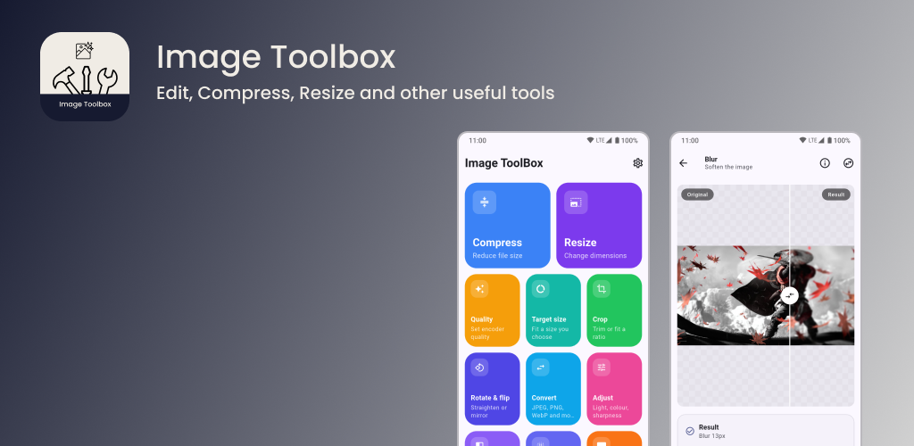

<p align="center">
  
</p>

<p align="center">
  A local-first, offline image utility for Android, iOS, Linux, macOS, and Windows. Pick an image (or several), choose a tool, preview the result, then save or share. Originals are never overwritten.
</p>

**Transform your images, entirely offline.**

A local-first, offline image utility for Android, iOS, Linux, macOS, and Windows. Pick an image (or several), choose a tool, preview the result, then save or share. Originals are never overwritten.

| | |
| --- | --- |
| **Version** | 1.0.0 (build 1) |
| **Android package** | `com.system74.imagetoolbox` |
| **Platforms** | Android · iOS · Linux · macOS · Windows |

## Features

Image ToolBox ships with **13 tools** across five categories:

| Category | Tools |
| --- | --- |
| **Compression** | Compress · Quality · Target size |
| **Edit** | Resize · Crop · Rotate & flip |
| **Conversion** | Convert (JPEG, PNG, WebP, GIF, BMP, TIFF) |
| **Enhance** | Adjust · Filters · Blur |
| **Utility** | Watermark · Remove metadata · Image info |

**Popular tools:** Compress, Target size, Resize, Crop, Convert

### Highlights

- **100% offline** — all processing on-device; no network, accounts, analytics, or ads
- **Batch processing** — available on every tool except Crop and Image info
- **Target file size** — compress to an exact KB/MB target (100 KB, 250 KB, 500 KB, 1 MB, 2 MB, or custom)
- **Privacy-first** — strip EXIF, GPS, and ICC metadata globally or per export
- **Non-destructive** — originals are read-only; exports go to a separate output folder
- **Live previews** — before/after views for Adjust, Filters, Blur, and Watermark
- **Material 3 UI** — light, dark, and system themes with six accent colours

## Workflow

```
Pick image(s) → Choose tool → Configure → Apply → Preview → Save / Share
```

You can also chain tools — apply one edit, then continue to another without starting over.

## Privacy

Image ToolBox processes everything on your device. No image ever leaves it and the app needs no network access in release builds.

- Photos are accessed read-only via the system picker (or camera, when you choose)
- Temporary working files can be cleared in **Settings → Clear temporary files**
- Metadata (EXIF/GPS) can be stripped on every export or with the dedicated **Remove metadata** tool
